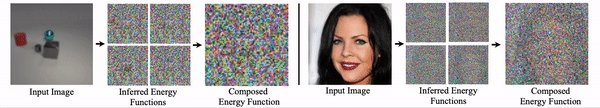

# Unsupervised Learning of Compositional Energy Concepts

This is the pytorch code for the paper [Unsupervised Learning of Compositional Energy Concepts](https://arxiv.org/abs/2111.03042).

<p align="center">
  
</p>

## Demo

Please download a pretrained model at this [link](https://www.dropbox.com/s/tld530rrpqxdif3/celebahq_128.pth?dl=0) and then execute the following code to test a pretrained CelebA-HQ 128x128 COMET model

```
python demo.py im_path=im0.png
```

# Global Factor Decomposition

Please utilize the following command to run global factor decomposition on CelebA-HQ  (or other datasets)

```
python train.py --exp=celebahq --batch_size=12 --gpus=1 --cuda --train --dataset=celebahq --step_lr=500.0
```

You may further run the code on high-resolution 128x128 images below

```
python train.py --exp=celebahq_128 --batch_size=12 --gpus=1 --cuda --train --dataset=celebahq_128 --step_lr=500.0
```

# Local Factor Decomposition

Please utilize the following command to run  local factor decomposition on CLEVR

```
python train.py --exp=clevr_local_decomp --num_steps=5 --step_lr=1000.0 --components=4 --dataset=clevr --cuda --train --batch_size=24 --latent_dim=16 --recurrent_model --pos_embed
```

# Dataset Download

Please utilize the following [link](https://www.dropbox.com/s/1uk59q8aembfirp/images_clevr.tar.gz?dl=0) to download the CLEVR dataset utilized in our experiments. Downloads for additional datasets will be posted soon. Feel free to raise an issue if there is a particular dataset you would like downloaded

# Citing our Paper

If you find our code useful for your research, please consider citing 

``` 
@inproceedings{du2021comet,
  title={Unsupervised Learning of Compositional Energy Concepts},
  author={Du, Yilun and Li, Shuang and Sharma, Yash and Tenenbaum, B. Joshua
  and Mordatch, Igor},
  booktitle={Advances in Neural Information Processing Systems},
  year={2021}
}
```
